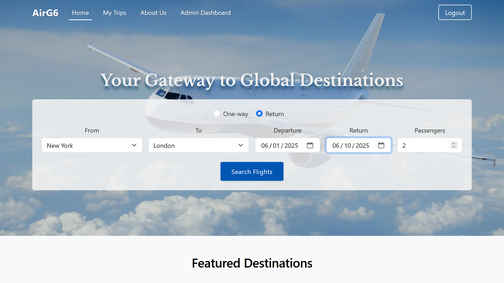
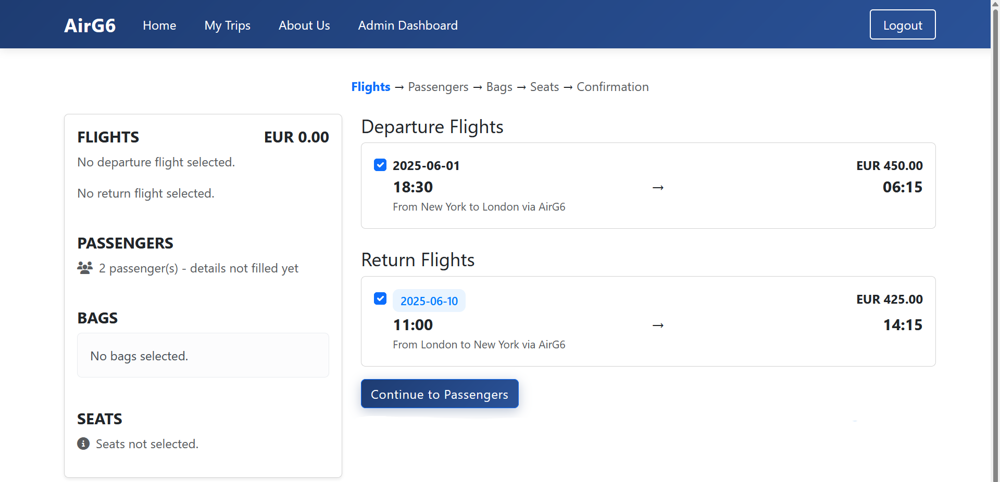
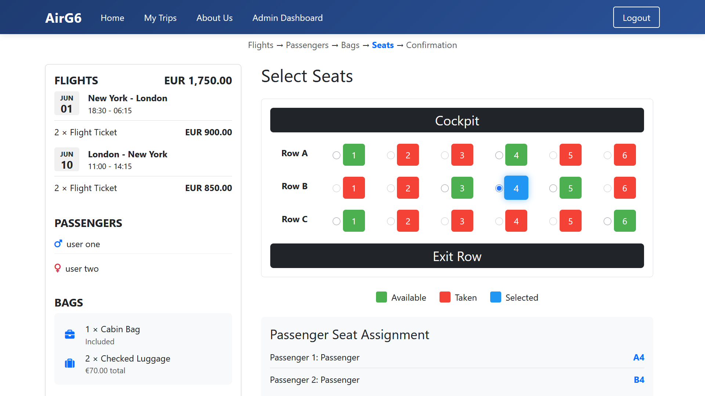
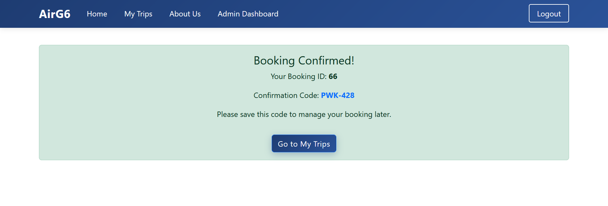
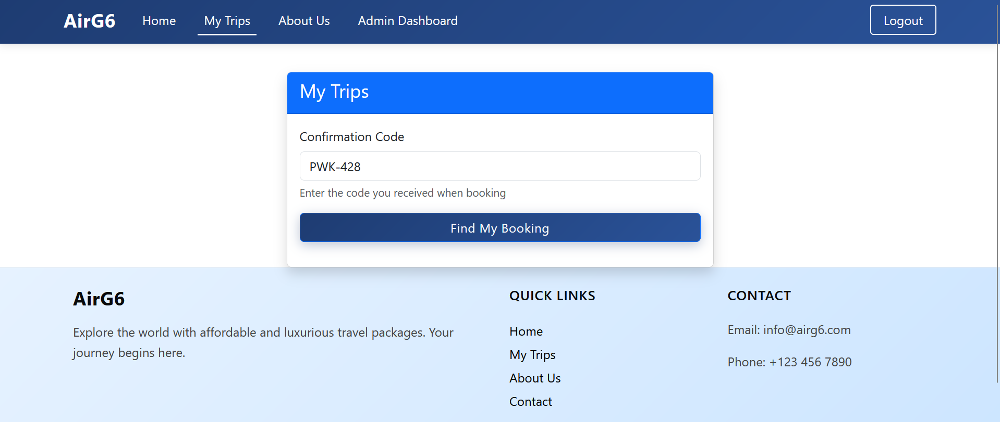
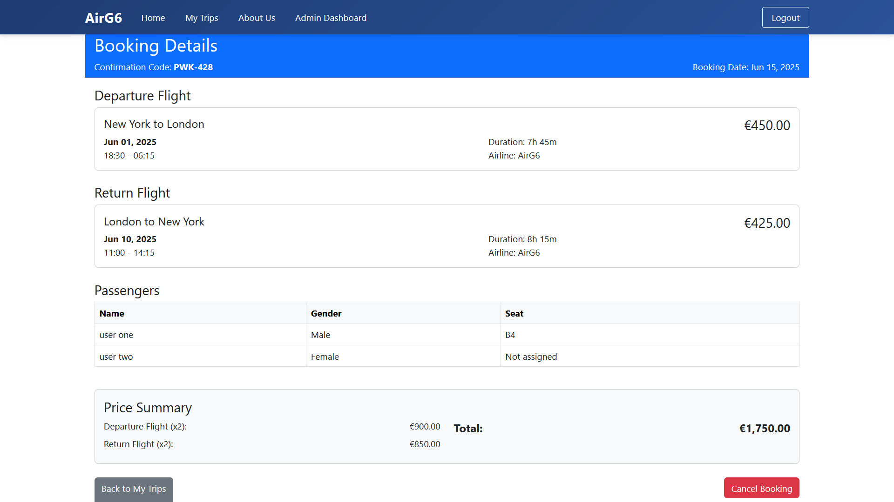
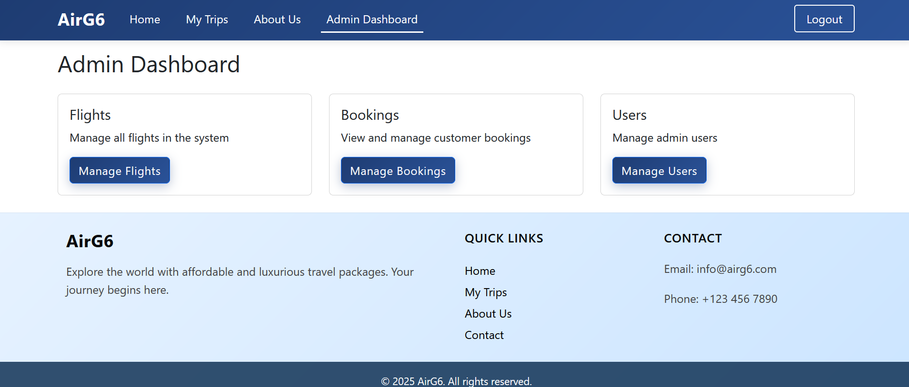
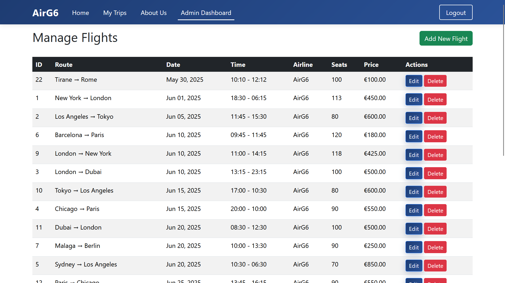

# AirG6 Airline Booking System

> A PHP-based airline booking platform that lets users search flights, book trips, select seats & services, and manage trips using a unique confirmation code.

---
### Link
[Website Link](https://airg6.free.nf)
---

## Features

### User Side (Guest Access)
- Search for **one-way** or **return** flights
- View available flights with **date, route, and price**
- Step-by-step booking process:
  - Flight selection
  - Passenger details
  - Baggage selection
  - Seat selection
  - Booking confirmation
- Auto-calculates **total price** based on number of passengers
- Displays **real-time booking summary**
- Generates a **unique confirmation code**
- “My Trips” page to:
  - View trip details
  - Cancel trip using confirmation code *(no login required)*

### Admin Dashboard (Login Required)
- Login authentication for admin
- Manage Flights *(CRUD)*
- Manage Bookings *(View and Delete)*
- Manage Users *(View and Edit)*
- View and edit admin profile

---

## Technologies Used

- **Frontend**: HTML, CSS, Bootstrap
- **Backend**: PHP
- **Database**: MySQL
- **Local Server**: XAMPP (Apache, MySQL)

---

## Screenshots

### Homepage

### Booking Process
**Search Flights**

**Select Seats**

**Booking Confirmed**

**My Trips**

**Booking Details**

### Admin Dashboard
**Dashboard Overview**

**Manage Flights**

---

## Project Setup

> **Note**: This project was developed using XAMPP and runs locally on `localhost`.

1. Clone this repository or download the ZIP.
2. Place the project folder inside your `htdocs/` directory.
3. Import the provided SQL file into your MySQL database.
4. Update `config.php` with your database credentials.
5. Run the project at `http://localhost/airline_website`.

